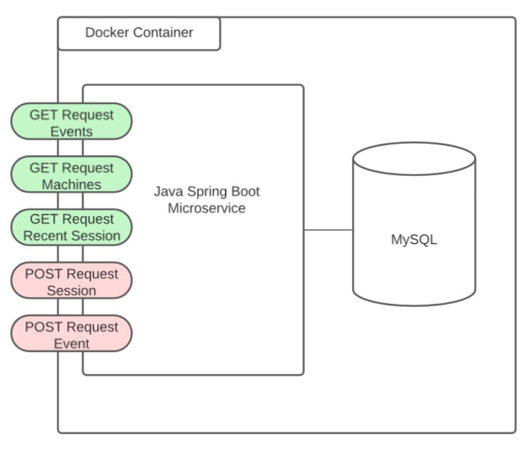
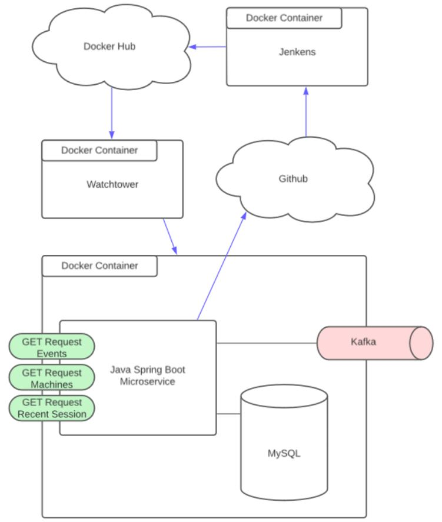

# John Deere Challenge Microservice

## Dependencies

- [Java](https://www.java.com/en/download/)
- [Spring Boot](https://spring.io/projects/spring-boot)
- [Docker](https://www.docker.com/)

## Setting Up the Project

1. Clone the repository:
   ```bash
   git clone https://github.com/davidlcassidy/jd-challenge
   cd jd-challenge
   ```

2. Update the Application Properties file with Local Database Credentials:
Open the `application.properties` file and update the properties with your local database credentials

## Running the Microservice Locally

### Using IntelliJ

1.  Open the project in IntelliJ IDEA.
    
2.  Run the main application class JDChallenge.
    

### Using Docker

1.  Build and run the Docker image:
    
   ```bash
   docker-compose up --build
   ```

## Architectural Documentation

### Current Architecture Diagram



### Future Improvements

I tried to limit my dev effort to eight hours as specified in the requirements document and unfortunately I ran out of time to implement everything I wanted to. I didn't have time to integrate in a queue, so I create two POST requests instead to allow the microservice to be fully tested. I was also not able build a deployment pipeline, but I documented what I was planning with blue arrows in the image below.



## Swagger API Documentation

Access the Swagger API documentation at http://localhost:8080/swagger-ui.html when the microservice is running locally.

## Postman Queries

Import the provided Postman collection for testing the endpoints.

 

